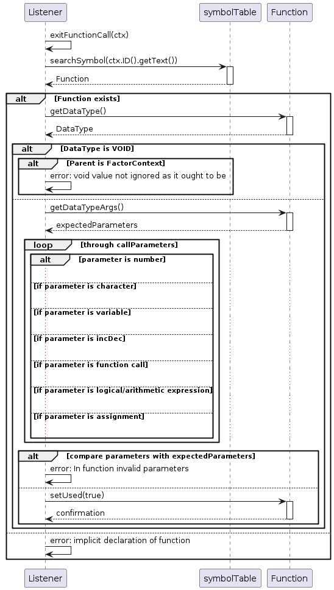

# PyCdeCompiladores_2023

Práctica y Construcción de Compiladores - FCEFyN - UNC

---

# Introducción 

En el mundo de la programación, los compiladores juegan un papel fundamental al traducir el código fuente de un lenguaje de programación a instrucciones ejecutables por una máquina. En el presente proyecto, se desarrolló un compilador para un lenguaje reducido basado en C. Este lenguaje, aunque inspirado en C, ha sido diseñado para presentar una versión simplificada, donde se han reducido ciertas funcionalidades y complejidades, manteniendo la esencia y estructura básica del lenguaje original.

El objetivo principal de este proyecto es explorar los fundamentos del diseño y desarrollo de compiladores al abordar un lenguaje de programación simplificado. Se busca comprender en detalle el proceso de análisis léxico, sintáctico y semántico, así como la generación de código intermedio y la optimización básica.

En este proyecto no se abordarán las etapas de generación y optimización de código objetivo.


## Herramientas

Para el desarrollo de este proyecto se utilizará ANTLR (Another Tool for Language Recognition). Esta es una herramienta de generación de analizadores para reconocer y procesar lenguajes tanto para su análisis léxico como sintáctico. Permite definir gramáticas mediante reglas y generar código (en nuestro caso JAVA) para construir analizadores que puedan reconocer la estructura de un lenguaje específico.

---

# Análisis Léxico

El análisis léxico es la primera fase del proceso de compilación. Recibe como entrada una secuencia de caracteres (código fuente) y lo convierte en una secuencia de tokes significativos para el compilador. Los tokens son unidades léxicas con significado semántico, como palabras reservadas, identificadores, operadores, constantes, que forman la base para la siguiente etapa de análisis sintáctico.

En la primera parte del archivo `compiladores.g4`, se pueden observar las expresiones regulares utilizadas para definir las palabras reservadas, operadores, identificadores de variables y tipos de variables.

Con el objetivo de analizar cada una de las etapas del compilador, se tomará de ejemplo el caso de una llamada a función, comenzando con las reglas léxicas necesarias para esto:


```g4
fragment LETTER : [A-Za-z];
fragment DIGIT : [0-9];
fragment PRINTABLE_ASCCI : [ -~];

PARENTHESES_O : '(';
PARENTHESES_C : ')';
COMMA : ',';
ID : (LETTER | '_')(LETTER | DIGIT | '_')*;
NUMBER : DIGIT+ ;
CHARACTER : '\'' PRINTABLE_ASCCI '\'';
```

1. `fragment LETTER : [A-Za-z]`: Define un fragmento de la  gramática que representa cualquier letra en mayúscula o minúscula.

2. `fragment DIGIT : [0-9]`: Define un fragmento que representa cualquier dígito del 0 al 9.

3. `fragment PRINTABLE_ASCII : [ -~]`: Define un fragmento de la gramática que define cualquier carácter imprimible en el rango ASCII del espacio a la ~.

4. `PARENTHESES_O`: Asigna el símbolo "(" a la regla llamada PARENTHESES_O.

5. `PARENTHESES_C`: Asigna el símbolo ")" a la regla llamada PARENTHESES_C.

6. `COMMA`: Asigna el símbolo "," a la regla llamada COMMA.

7. `ID : (LETTER | '')(LETTER | DIGIT | '')*`: Define un identificador que comienza con una letra o un guion bajo, seguido de letras, dígitos o guiones bajos adicionales.

8. `NUMBER : DIGIT+`: Representa un número como una secuencia de uno o más dígitos.

9. `CHARACTER : ''' PRINTABLE_ASCCI '''`: Define un carácter delimitado por comillas simples que puede contener cualquier carácter imprimible en ASCII.


# Análisis Sintáctico

La siguiente fase del proceso de compilación trabaja en conjunto con la anterior. Mientras que el análisis léxico se enfoca en la estructura léxica del código fuente, el análisis sintáctico, se concentra en la estructura gramatical del mismo, verificando si los tokens generados siguen la secuencia y la sintaxis correcta definida por la gramática del lenguaje. 

Al finalizar esta etapa, si no hubo errores, se obtiene un árbol sintáctico que refleja la organización de las construcciones del lenguaje de programación, siendo un reflejo directo de las reglas gramaticales definidas para el mismo.

En el archivo `compiladores.g4` se encuentran definidas todas las reglas gramaticales para el lenguaje.

Continuando con el ejemplo de la llamada a función, se analizarán las reglas gramaticales definidas para esto.

```g4
functionCall : ID PARENTHESES_O callParameters PARENTHESES_C
             ;

callParameters : parameter 
               | parameter COMMA callParameters
               |
               ;

parameter : NUMBER
          | CHARACTER
          | ID
          | functionCall
          | logicalArithmeticExpression
          ;
```

Lo primero que se debe notar es la presencia de las reglas léxicas analizadas anteriormente dentro de las reglas gramaticales.

La primera regla fija la estructura general de una llamada a función, la misma debe comenzar con un ID (nombre de la función) y luego se deben colocar entre paréntesis un listado de parámetros.

Este listado de parámetros se define en la regla callParameters, donde vemos que la lista puede contener 0 o más parámetros.

Cada uno de los parámetros a su vez puede ser, un número, un caracter, un ID, otra llamada a función o una expresión aritmético lógica.


# Análisis Semántico

El análisis semántico es la fase del proceso de compilación que se encarga de verificar las reglas y restricciones semánticas del código fuente que no pueden ser verificadas por las etapas anteriores. Va más allá de la estructura gramatical y se enfoca en el significado y la lógica del código.

En este caso, se hace uso de los listeners creados por ANTLR para recorrer el árbol sintáctico generado en la etapa anterior para realizar el análisis semántico. Estos listeners permiten recorrer de forma automática ya que genera eventos al entrar y salir de ciertos nodos.

## Tabla de símbolos 
En esta etapa es de suma importancia la generación de una tabla de símbolos. Esta, es una estructura de datos para almacenar información sobre los identificadores encontrados en el código fuente. Sirve como una especie de diccionario que mapea los nombres de variables, funciones, tipos u otros símbolos a información relevante asociada a ellos (Identificador, alcance (scope) y contexto, verificación de tipos, estado, etc).

Para analizar esto, veamos un diagrama de secuencias simplificado de la función exitFunctionCall() que es la que se dispara cada vez que se sale de un nodo functionCall.



Lo primero que hace al salir de este nodo es buscar el ID de la función en la tabla de símbolos, la búsqueda se hace desde el contexto actual hacia arriba (la función puede estar definida en un contexto mayor). En caso de que la función no exista se lanza un error.

Luego, pregunta por el tipo de la función (tipo de dato que retorna). En caso de que sea VOID, verifica que la llamada a función no sea un factor (si fuese un factor significa que necesita usar el valor de retorno), si es un factor lanza un error.

Ahora, si la función no es void, comienza a recorrer los parámetros ingresados y los compara contra los de la función (consulta a la tabla de símbolos por los parámetros esperados). Realiza una comparación entre los parámetros obtenidos y los esperados y lanza un error (o nó) en función del resultado.

Por último, modifica la tabla de símbolos para indicar que la función ha sido usada.

# Generación de Código Intermedio

El código intermedio que se genera en esta etapa es conocido como código de tres direcciones, debido a que en cada instrucción sólo pueden verse afectadas hasta tres direcciones de memoria. Este código es demasiado similar a un código en lenguaje assembly.

Una vez que llegamos a esta etapa, tenemos un árbol semántico que no tiene errores léxicos, sintácticos ni semánticos, por lo tanto nos asegura que podemos generar un código intermedio (no quiere decir que el código haga lo que nosotros queremos pero si cumple con las reglas del lenguaje).

Para la generación de este código intermedio, se utilizan los visitors generados por ANTLR para recorrer el árbol. A diferencia de los Listeners, con el Visitor el programador tiene el control para decidir en que momento visitar un nodo particular. 

Siguiendo con el ejemplo, veremos la generación de código intermedio para una llamada a función.


# Optimización de Código Intermedio